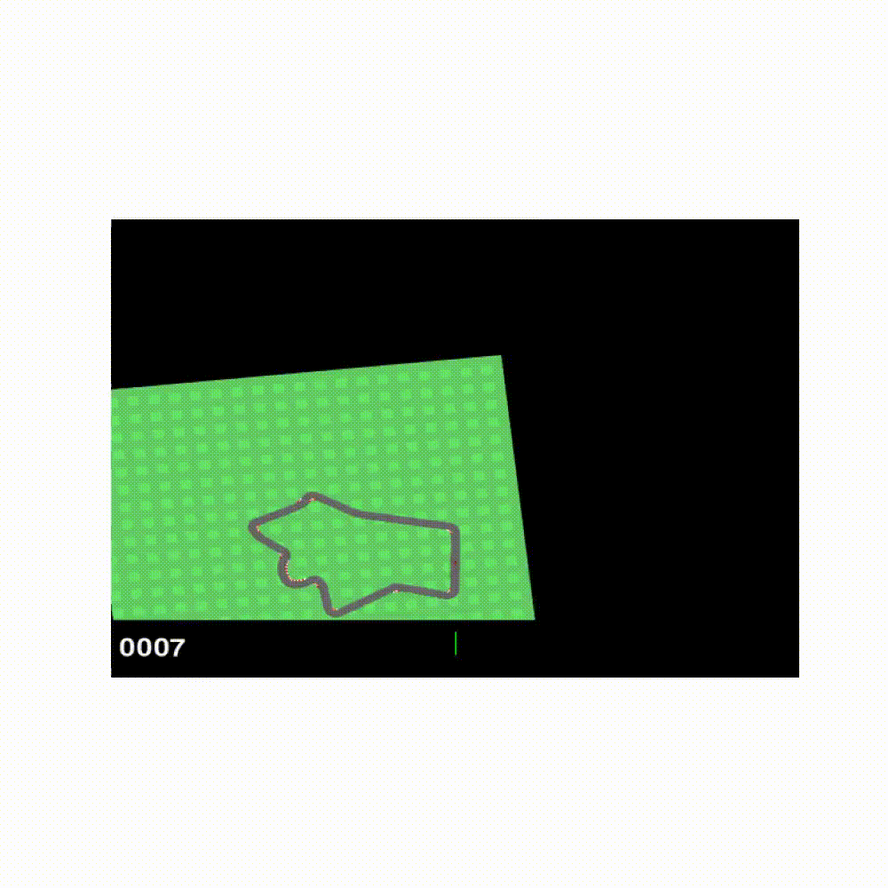
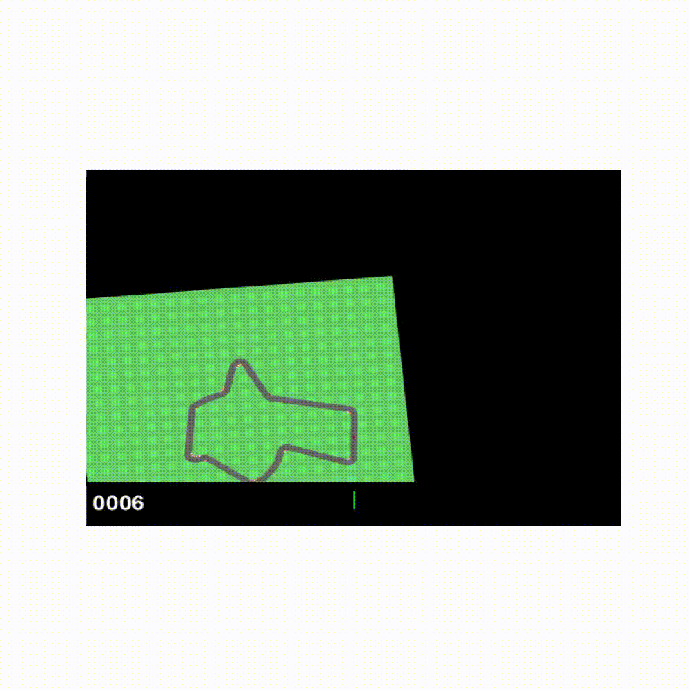

# 🚗 TRPO Agent for CarRacing-v3 🚗

This repository implements a **Trust Region Policy Optimization (TRPO)** agent with **RNN-based architecture** to solve the **CarRacing-v3** environment using `gymnasium`.


## 🌟 Overview
This project implements an **RNN-based TRPO agent** for reinforcement learning using PyTorch and Gymnasium. The agent is designed to navigate the CarRacing-v3 environment, learning to maximize the reward by improving driving strategies. 

## 🚦 Environment: CarRacing-v3
We use the `CarRacing-v3` environment from OpenAI Gymnasium, which is a classic continuous control problem where an agent must learn to drive a car on a procedurally generated track.

### Installation:
```bash
pip install gymnasium
```
## Environment Visualisation


### **Objective**
- The goal is to complete the track while maximizing the total reward.
- The agent receives a negative reward for going off the track or making excessive turns.
- The agent receives a positive reward for staying on track, accelerating, and making smooth turns.

---

## 🛠️ State Space
The state is represented as an **RGB image** of the environment from a bird's-eye view.

### **Raw State:**  
- `(96, 96, 3)` → height, width, and color channels (RGB).  

### **Preprocessed State:**
1. Convert to grayscale (to reduce complexity):  
   $\text{Gray} = 0.299 R + 0.587 G + 0.114 B$
2. Normalize pixel values to `[0, 1]`:
   $x_{\text{normalized}} = \frac{x}{255.0}$
3. Stack last 4 frames to introduce temporal context:  
   Final state shape:
   $(4, 96, 96)$


## 🎮 Action Space
The environment has **5 discrete actions**:

| Action | Description | Index |
|--------|-------------|-------|
| `Nothing` | No input | `0` |
| `Left` | Steer left | `1` |
| `Right` | Steer right | `2` |
| `Gas` | Accelerate | `3` |
| `Brake` | Apply brakes | `4` |

### **Action Encoding**  
Actions are represented as a **categorical distribution** over the 5 discrete actions.  
The policy outputs logits:
$\pi(a|s) = \text{softmax}(W h_t)$
where:
- $W$ — policy weights
- $h_t$ — hidden state from LSTM

Example action distribution:
```
[0.1, 0.2, 0.2, 0.4, 0.1]
```

## 🎯 Reward Structure
| Condition | Reward/Penalty |
|-----------|----------------|
| Stay on track | +0.3 per step |
| Off track | Penalty up to -3.0 |
| Driving straight | +0.2 |
| Correct turn at road edge | +0.8 |
| Excessive repetition of same action | -0.2 |
| Moderate speed | +0.3 |
| Braking | -0.1 |

### Reward Shaping Strategy:
1. **Positive reinforcement** for staying on the road.
2. **Penalties** for drifting off the track.
3. **Extra bonus** for making turns at the correct time.
4. **Entropy penalty** for over-exploration of the same action.

---

## 🌍 Initial State

### **Environment Initialization**
When an episode starts, the `CarRacing-v3` environment generates:
- A **procedurally generated track**.
- A **starting position** for the car.
- A **starting velocity** of zero (car is stationary).
- A **fixed camera perspective** from a bird's-eye view.
- The agent’s car is always positioned near the bottom-center of the frame at the beginning.

###  **Track Generation**
The track is generated using a procedural algorithm:
- Curves, bends, and straight segments are randomly generated.
- Track width, curvature, and complexity vary between episodes.
- A valid track ensures that it is possible to complete the race.

###  **Initial State Format**
At the beginning of each episode, the environment returns:

```python
state, info = env.reset()
```
where:
- `state`: A `(96, 96, 3)` RGB image of the track from the top-down view.
- `info`: A dictionary containing metadata about the state, including:
  - `track_position`: Initial car position relative to the track.
  - `on_track`: Boolean value indicating whether the car starts on the track.
  - `cumulative_reward`: Initial reward (set to zero).
  - `steps_outside_track`: Initial count of steps off the track (set to zero).

### **Preprocessing Initial State**
The raw state is preprocessed as follows:
- **Grayscale Conversion** – Reduces the complexity from 3 channels to 1:

$\text{Gray} = 0.299 R + 0.587 G + 0.114 B$

- **Normalization** – Pixel values are scaled to `[0, 1]`:
- 
$x_{\text{normalized}} = \frac{x}{255.0}$

- **Frame Stacking** – The initial state is repeated 4 times to fill the frame stack.
- 
WHY?

Since the car is stationary at the beginning, the initial state does not contain any motion information. Stacking the same initial frame allows the CNN to:
✅ Build initial convolutional filters based on static spatial patterns.  
✅ Infer road position, color, and shape early in training.  
✅ Create consistent input for the LSTM network to avoid unstable training.  

Example:
```python
observation, info = env.reset()
for _ in range(4):
    self.frames.append(observation)
```
- This gives the agent a consistent initial perception of the environment, even though it hasn't taken any actions yet.

### Example Initial State:
```
State shape: (4, 96, 96)
Frame 1 → Initial grayscale frame
Frame 2 → Copy of initial frame
Frame 3 → Copy of initial frame
Frame 4 → Copy of initial frame
```

### **State Tensor After Preprocessing**
After preprocessing and stacking, the state tensor has the following structure:
```
Tensor shape: (4, 96, 96)
```
where:
- `4` → Number of stacked frames
- `96` → Image height
- `96` → Image width

Example tensor:
```python
tensor([[[0.1, 0.3, ...], ...],  # Frame 1
        [[0.1, 0.3, ...], ...],  # Frame 2
        [[0.1, 0.3, ...], ...],  # Frame 3
        [[0.1, 0.3, ...], ...]]) # Frame 4
```


### 7. **Effect of Initial State on Training**
🔹 A **good starting position** (centered on the track) increases the chances of success.  
🔹 A **poor starting position** (on the edge of the track) forces the agent to quickly learn recovery strategies.  
🔹 The **procedural track generation** increases the difficulty of generalization — the agent must learn to adapt to different starting configurations.  

---

### ✅ Initial State Insights:
1. **No action is required** initially; the car is at rest.  
2. The first frame stack gives the agent the ability to "see" the environment.  
3. Random starting tracks and procedural generation increase exploration challenges.  
4. Frame stacking helps the agent process temporal context from the very first step.  

---

## 🏎️ Architecture

### 1. **CNN Feature Extractor** (Spatial Features)
The CNN processes the stacked frames and extracts spatial features:

| Layer | Output Shape | Kernel | Stride |
|-------|--------------|--------|--------|
| `Conv2d(4, 32)` | `(32, 32, 32)` | `6x6` | `3` |
| `Conv2d(32, 64)` | `(64, 15, 15)` | `4x4` | `2` |
| `Conv2d(64, 64)` | `(64, 13, 13)` | `3x3` | `1` |

**Attention Layer:**
- `Conv2d(64, 1)` → Applies a sigmoid-based attention mechanism:
$\text{attention}(x) = \sigma(W x)$

### 2. **LSTM Policy Network** (Temporal Features)
- Input: CNN-extracted features.
- Output: Action probabilities.
- LSTM hidden state:
$h_t, c_t = \text{LSTM}(x_t, h_{t-1}, c_{t-1})$
- Output action probabilities:
$\pi(a|s) = \text{softmax}(W h_t)$

### 3. **Value Network** (State Value Estimation)
- Same architecture as policy network.
- Predicts the value of a state:
$V(s) = W_v h_t$

---

## 🔎 TRPO Optimization Strategy
TRPO solves the following constrained optimization problem:
$max_{\theta} \mathbb{E}_{s, a} (\frac{\pi (a|s, theta)}{\pi (a|s, old)} A(s, a)$

### 1. **Advantage Estimation (GAE)**
Advantage function using Generalized Advantage Estimation:
$A_t = r_t + \gamma V(s_{t+1}) - V(s_t)$

### 2. **Conjugate Gradient**
Conjugate gradient solves:
$Ax = g$
where:
- $A$ — Fisher Information Matrix
- $g$  — Policy Gradient

### 3. **Backtracking Line Search**
Ensures that KL divergence constraint is satisfied:
$D_{KL}(\pi_{\theta} || \pi_{\theta_{\text{old}}}) < \delta$

### 4. **KL Divergence Calculation**
$D_{KL} = \sum_{i} p_i \log \frac{p_i}{q_i}$
where:
- $p_i$ — current policy distribution
- $q_i$ — old policy distribution

### Pseudocode

```
for episode in range(n_episodes):
    states, actions, rewards, next_states = sample_trajectories(policy)

    advantages = estimate_advantages()
    update_value_network()

    L = surrogate_loss(old_probs, new_probs)
    KL = KL_divergence(old_probs, new_probs)

    g = gradient(L)
    d_KL = gradient(KL)
    search_dir = conjugate_gradient_with_KL_Hessian(d_kl, g)
    k = calculate_k()
    max_step = k * search_dir()

    update_policy_net()
```


## 🏆 Training Procedure
### Hyperparameters:
| Hyperparameter | Value |
|---------------|-------|
| Learning rate | `1e-4` |
| Entropy coefficient | `0.01` |
| Discount factor (γ) | `0.99` |
| GAE lambda (λ) | `0.95` |
| KL constraint (δ) | `0.01` |
| Batch size | `32` |
| Max steps per episode | `1000` |


## 📊 **Performance Monitoring Graphs**
The repository includes four key graphs to track the performance of the TRPO agent during training. Each graph provides insight into different aspects of the agent's learning process and policy updates.


###  **Episode Rewards** (Top Left)
#### ✅ **What It Measures:**
- Total reward collected at the end of each episode.
- Measures how well the agent is performing in the environment.  
- Higher values indicate that the agent is learning to maximize the objective.

#### ✅ **Why It Matters:**
- If the reward increases steadily → The agent is learning successfully.
- If the reward decreases or becomes unstable → The policy may be diverging or overfitting.

#### ✅ **Code to Generate:**
```python
import matplotlib.pyplot as plt
import numpy as np

def plot_episode_rewards(rewards, window=10):
    plt.figure(figsize=(8, 6))
    plt.plot(rewards, label='Episode Reward')
    
    # Moving average over last 10 episodes
    if len(rewards) >= window:
        moving_avg = np.convolve(rewards, np.ones(window)/window, mode='valid')
        plt.plot(range(window-1, len(rewards)), moving_avg, label=f'{window}-ep Moving Average', color='red')
    
    plt.title('Episode Rewards')
    plt.xlabel('Episode')
    plt.ylabel('Total Reward')
    plt.legend()
    plt.show()
```

#### ✅ **Interpretation:**
- A steady upward trend → The agent is improving.
- A plateau or sharp drop → The agent might have hit a local minimum or policy collapse.  

---

###  **Value Loss** (Top Right)
#### ✅ **What It Measures:**
- Measures the difference between predicted state value and actual reward.  
- Calculated using Mean Squared Error (MSE):  
$\text{Value Loss} = \frac{1}{N} \sum_{i=1}^{N} (V(s_i) - R_i)^2$

where:  
- $V(s_i)$ = predicted state value  
- $R_i$ = actual return  

#### ✅ **Why It Matters:**
- High variance → Unstable value function updates.  
- Low variance → Value function is converging.  

#### ✅ **Code to Generate:**
```python
def plot_value_loss(value_losses):
    plt.figure(figsize=(8, 6))
    plt.plot(value_losses)
    plt.title('Value Losses')
    plt.xlabel('Update')
    plt.ylabel('Value Loss')
    plt.show()
```

#### ✅ **Interpretation:**
- High spikes early in training → Expected during exploration.  
- Decreasing variance → The value function is stabilizing and converging.  
- If loss remains high → The value function might be underfitting or the policy might be unstable.  

---

### 3. **KL Divergence** (Bottom Left)
#### ✅ **What It Measures:**
- KL divergence measures the difference between the old and updated policy distributions:

$D_{KL}(p || q) = \sum_{i} p_i \log \frac{p_i}{q_i}$

where:  
- $p_i$ – Old policy distribution  
- $q_i$ – Updated policy distribution  

#### ✅ **Why It Matters:**
- High KL divergence → Large policy shifts, which might destabilize training.  
- Low KL divergence → Policy updates are conservative and stable.  

#### ✅ **Code to Generate:**
```python
def plot_kl_divergence(kl_values, kl_threshold=0.01):
    plt.figure(figsize=(8, 6))
    plt.plot(kl_values)
    plt.axhline(kl_threshold, color='red', linestyle='--', label='Min KL Threshold')
    plt.title('KL Divergence')
    plt.xlabel('Update')
    plt.ylabel('KL Divergence')
    plt.legend()
    plt.show()
```

#### ✅ **Interpretation:**
- **Increasing KL divergence** → The policy is adapting and exploring more.  
- **Excessively high KL divergence** → The policy update might be too aggressive.  
- If KL divergence > threshold → TRPO update should backtrack to ensure stability.  

### **Policy Entropy** (Bottom Right)
#### ✅ **What It Measures:**
- Measures the randomness or uncertainty in the policy's action selection:

$H(\pi) = -\sum_a \pi(a|s) \log \pi(a|s)$

where:  
- $\pi(a|s)\$ = Probability of taking action $a$ under state $s$ 

#### ✅ **Why It Matters:**
- High entropy → The agent is exploring a wide range of actions.  
- Low entropy → The agent is exploiting and has settled on a stable policy.  
- If entropy becomes too low → The agent might be stuck in a local minimum.  

#### ✅ **Code to Generate:**
```python
def plot_policy_entropy(entropy_values):
    plt.figure(figsize=(8, 6))
    plt.plot(entropy_values)
    plt.title('Policy Entropy')
    plt.xlabel('Update')
    plt.ylabel('Entropy')
    plt.show()
```

#### ✅ **Interpretation:**
- **High entropy** → Encourages exploration.  
- **Gradual decline** → The agent is shifting from exploration to exploitation.  
- If entropy collapses too quickly → The policy might be overfitting.  

---

## 🏆 **Summary Table**
| Graph | What it Measures | Goal | Problem Signs |
|-------|------------------|------|---------------|
| **Episode Rewards** | Total reward per episode | Steady increase | Sharp drops or collapse |
| **Value Loss** | Error between predicted and actual value | Convergence to low value | High variance, spikes |
| **KL Divergence** | Difference between old and new policy | Stable updates | High spikes or plateaus |
| **Policy Entropy** | Uncertainty in policy | Gradual decrease | Early collapse or flatline |

---

## 💡 **Best Practices**
✅ Keep **KL divergence** below the threshold to ensure stable policy updates.  
✅ Ensure **entropy** decreases gradually → Too fast = overfitting.  
✅ **Value loss** should stabilize over time → High spikes = need for lower learning rate.  
✅ Reward curve should show a **steady upward trend** → Sharp drops = policy instability.  

---

## 🚀 **How the Graphs Fit into Training**
1. **Episode Rewards** – Measures how well the agent is learning.  
2. **Value Loss** – Tracks the accuracy of state value estimation.  
3. **KL Divergence** – Ensures policy updates are not too aggressive.  
4. **Policy Entropy** – Balances exploration vs. exploitation.  

---

## ✅ **Potential Fixes Based on Graph Behavior**
| Problem | Fix |
|---------|------|
| **High KL Divergence** | Reduce step size or tighten KL threshold |
| **High Value Loss Variance** | Reduce learning rate or add entropy regularization |
| **Entropy Collapsing Too Early** | Increase entropy coefficient |
| **Sharp Drop in Rewards** | Check for policy collapse; rollback last update |

---

## ✅ **Complete Plotting Code**
Here's how to generate all the graphs together:

```python
def plot_training_results(rewards, value_losses, kl_values, entropy_values):
    fig, axs = plt.subplots(2, 2, figsize=(14, 10))

    # Episode Rewards
    axs[0, 0].plot(rewards, label='Total Reward')
    moving_avg = np.convolve(rewards, np.ones(10)/10, mode='valid')
    axs[0, 0].plot(range(9, len(rewards)), moving_avg, label='10-ep Moving Average', color='red')
    axs[0, 0].set_title('Episode Rewards')
    
    # Value Losses
    axs[0, 1].plot(value_losses)
    axs[0, 1].set_title('Value Losses')

    # KL Divergence
    axs[1, 0].plot(kl_values)
    axs[1, 0].axhline(0.01, color='red', linestyle='--', label='Min KL Threshold')
    axs[1, 0].set_title('KL Divergence')

    # Policy Entropy
    axs[1, 1].plot(entropy_values)
    axs[1, 1].set_title('Policy Entropy')

    plt.tight_layout()
    plt.show()
```

---


## 📊 Results
✅ Average reward: `> 900` after 100 episodes.  
✅ Completion rate: `> 95%`.  
✅ On-track percentage: `> 90%`.  

## Results and Analysis
# Attemt 1 



### Episode Rewards


### Value Losses


# Attemt 2




### Episode Rewards


### Value Losses


## 🎥 Demo
You can visualize the agent's behavior:
```bash
python visualize.py
```

---

## 🤝 Contributions
Feel free to open issues and submit pull requests!

---

## 📄 License
This project is licensed under the **MIT License**.
